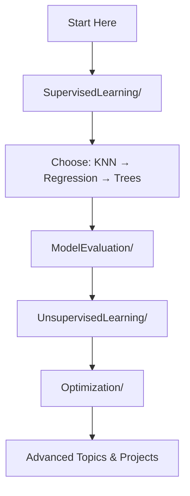

# 🤖 Machine Learning from Data - Repository Guide

<div align="center">


*Complete implementation and study materials for machine learning algorithms and techniques*

**Instructors:** Prof. Ilan Gronau & Dr. Alon Kipnis

</div>

---

## 📁 Repository Structure

This repository contains comprehensive implementations, examples, and study materials for machine learning concepts. Each major topic is organized into dedicated folders with detailed implementations and explanations.

```
📦 Machine-Learning-From-Data/
├── 📁 SupervisedLearning/          # Labeled data learning algorithms
├── 📁 UnsupervisedLearning/        # Pattern discovery without labels  
├── 📁 Optimization/                # Mathematical optimization techniques
├── 📄 SUMMARY.md                   # Course recap and quick reference
├── 📄 README.md                    # This navigation guide
└── 📄 .gitignore                   # Git ignore configurations
```

---

## 🎯 SupervisedLearning/

**What you'll find:** Complete implementations of algorithms that learn from input-output pairs.

### 📂 Folder Structure:
```
SupervisedLearning/
├── 📁 KNearestNeighbors/          # Instance-based learning
├── 📁 RegressionModels/           # Linear & polynomial regression
├── 📁 DecisionTrees/              # Tree-based classification
├── 📁 BayesianClassification/     # Probabilistic classifiers
├── 📁 Perceptron/                 # Linear separators
├── 📁 LogisticRegression/         # Probabilistic linear models
├── 📁 SupportVectorMachines/      # Maximum margin classifiers
├── 📁 ModelEvaluation/            # Validation & testing techniques
└── 📄 README.md                   # Supervised learning overview
```

### 🔍 What Each Subfolder Contains:
- **Implementation files** (`.py`, `.ipynb`)
- **Example datasets** and use cases
- **Theoretical explanations** with mathematical foundations
- **Hyperparameter tuning** guides
- **Comparative analysis** between methods

---

## 🔍 UnsupervisedLearning/

**What you'll find:** Algorithms for discovering hidden patterns and structures in unlabeled data.

### 📂 Folder Structure:
```
UnsupervisedLearning/
├── 📁 DistributionLearning/       # Probability distribution fitting
├── 📁 Clustering/                 # Data grouping algorithms
│   ├── 📁 KMeans/                 # Centroid-based clustering
│   └── 📁 HierarchicalClustering/ # Tree-based clustering
├── 📁 ExpectationMaximization/    # EM algorithm implementations
├── 📁 DimensionalityReduction/    # PCA, LDA techniques
└── 📄 README.md                   # Unsupervised learning overview
```

### 🔍 What Each Subfolder Contains:
- **Algorithm implementations** with step-by-step explanations
- **Visualization tools** for understanding data patterns
- **Real-world datasets** for practice
- **Performance metrics** and evaluation methods
- **Interactive notebooks** for experimentation

---

## ⚙️ Optimization/

**What you'll find:** Mathematical optimization techniques that power machine learning algorithms.

### 📂 Folder Structure:
```
Optimization/
├── 📁 GradientDescent/            # First-order optimization methods
│   ├── 📁 StandardGD/             # Batch gradient descent
│   ├── 📁 StochasticGD/           # SGD and mini-batch variants
│   └── 📁 SubgradientDescent/     # Non-smooth optimization
├── 📁 LossFunctions/              # Objective functions
│   ├── 📁 LeastSquares/           # Regression loss
│   ├── 📁 CrossEntropy/           # Classification loss
│   └── 📁 HingeLoss/              # SVM loss
├── 📁 ConstrainedOptimization/    # Lagrangian methods
│   ├── 📁 LagrangeMultipliers/    # Equality constraints
│   └── 📁 DualProblems/           # Dual formulations
└── 📄 README.md                   # Optimization overview
```

### 🔍 What Each Subfolder Contains:
- **Mathematical derivations** with clear explanations
- **Implementation examples** showing convergence
- **Visualization tools** for optimization landscapes
- **Performance comparisons** between methods
- **Practical tips** for hyperparameter tuning

---

## 🚀 Getting Started

### Prerequisites
```bash
pip install numpy pandas matplotlib scikit-learn jupyter seaborn
```

### Quick Navigation Tips

1. **🎯 New to ML?** Start with `SupervisedLearning/KNearestNeighbors/` - it's the most intuitive
2. **📊 Want theory?** Check each folder's `README.md` for mathematical foundations  
3. **💻 Hands-on learning?** Look for `.ipynb` files with interactive examples
4. **🔧 Implementation details?** `.py` files contain clean, documented code
5. **📈 Performance insights?** `ModelEvaluation/` folder has comprehensive metrics

### Recommended Learning Path



---

## 📖 How to Use This Repository

### For Students 📚
- **Follow the learning path** above for structured progression
- **Run notebooks** to see algorithms in action
- **Modify parameters** to understand algorithm behavior
- **Compare implementations** to solidify understanding

### For Practitioners 💼
- **Jump to specific algorithms** you need for projects
- **Use evaluation tools** for model selection
- **Adapt implementations** for your datasets
- **Reference mathematical foundations** for deeper insights

### For Researchers 🔬
- **Study optimization techniques** for algorithm development
- **Analyze theoretical foundations** in each README
- **Extend implementations** for novel approaches
- **Use visualization tools** for result presentation

---

## 🛠️ Repository Features

- ✅ **Complete Implementations**: Every algorithm from the course
- ✅ **Interactive Examples**: Jupyter notebooks with live demonstrations  
- ✅ **Real Datasets**: Practical examples beyond toy problems
- ✅ **Visualization Tools**: Understanding through visual exploration
- ✅ **Mathematical Foundations**: Theory explained clearly
- ✅ **Performance Metrics**: Proper evaluation techniques
- ✅ **Modular Code**: Clean, reusable implementations

---

## 📋 File Types Guide

| File Type | Purpose | When to Use |
|-----------|---------|-------------|
| `📄 README.md` | Theory & overview | Understanding concepts |
| `📓 .ipynb` | Interactive examples | Hands-on learning |
| `🐍 .py` | Clean implementations | Production code reference |
| `📊 .csv/.json` | Example datasets | Testing algorithms |
| `📈 .png/.svg` | Visualizations | Understanding results |

---

## 🤝 Contributing

This repository is designed for learning and experimentation. Feel free to:
- 🔧 Improve existing implementations
- 📊 Add new datasets or examples  
- 📝 Enhance documentation
- 🎨 Create better visualizations
- 🧪 Add comparative studies

---

<div align="center">

### 🎓 Ready to Dive In?

Choose your path and start exploring! Each folder contains everything you need to master that topic.

**Remember:** The best way to learn ML is by implementing and experimenting! 🚀

---


</div>